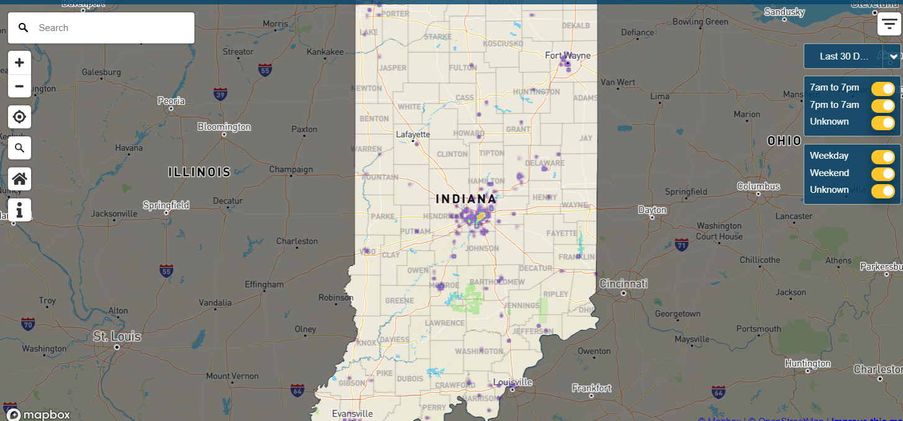

# Project Two
Grant Leach, Mary Whistler, Mark Hirschenberger, Veronica Hamilton, Catherine Smith

## Chosen Topic and Rationale
We chose to look at pothole data within Bloomington. We chose this topic because we think there is potential for making a nice interactive visualization on pothole density.

## Link to Data and Screenshot of Metadata
https://catalog.data.gov/dataset/pothole-reports/resource/694b489a-1c6a-4fc3-91df-e1c3248e0518

## Inspiration

## Outline of Final Design
*  Interactive map of Bloomington potholes
*  Dropdown menu to filter reported potholes by date
*  Mouse over event or other interactive feature to provide adcitional info on each report

## Link to GitHub Repository
https://github.com/marbwhist/project_two_group_one
